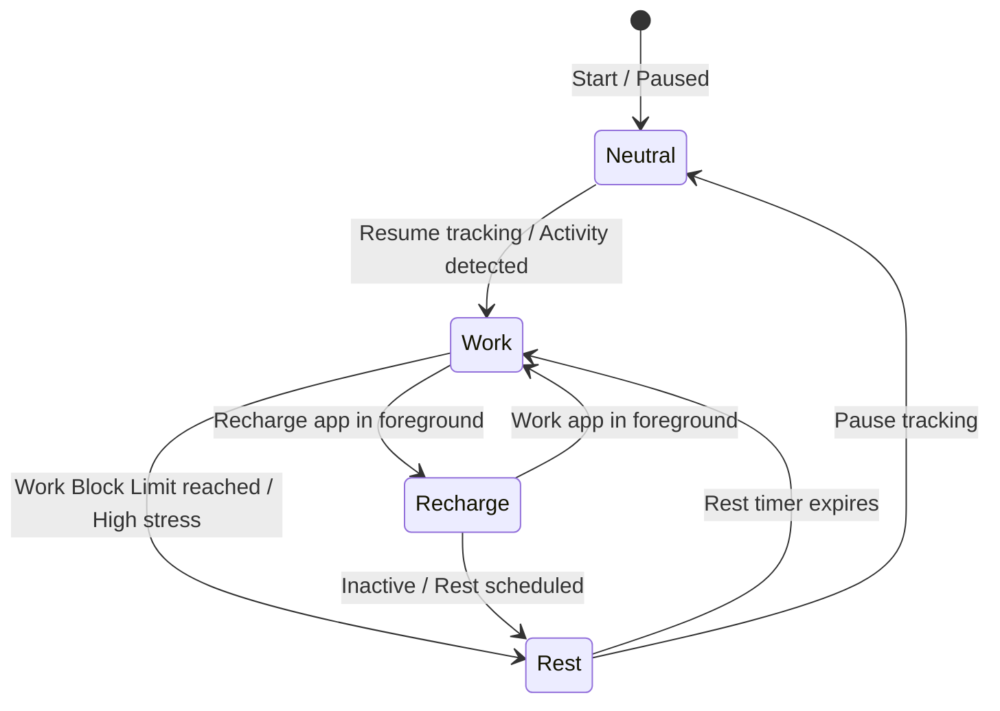

# MIND-FLOW // Functional & Logical Specification

This document defines the logical domains, state machines, background handlers, and API schemas of **MIND-FLOW**. It contains **no details of the existing UI layout, styles, or page structure**, serving as a clean functional blueprint to design a completely new user interface from scratch.

---

## 1. Core State Machine & Focus Pacing

MIND-FLOW pacing is governed by a state machine that controls the user's focus rhythm and battery levels.



### State Definitions
*   **Work Mode**: Represents active, focused task execution. The user's cognitive battery depletes over time.
*   **Recharge Mode**: Active during low-intensity leisure or distraction intervals. The cognitive battery recharges slowly.
*   **Rest Mode**: An enforced physical break. The screen locks out input, and the battery recharges rapidly.
*   **Neutral State**: Active tracking is paused or disabled.

### State Transitions & Logic
*   **Automatic Transition**: Controlled by tracking foreground window titles and processes, matching them against classifier keywords.
*   **Visual Shield Lockout**: Active only in *Rest Mode*. It enforces a physical break with a countdown timer, rendering recovery exercises (eye care, physical stretches) and blockading work interfaces.
*   **Cognitive Autopilot (Adaptive Pacing)**: An intelligent timing engine that dynamically scales the work block duration based on:
    *   Self-reported fatigue and check-in scores.
    *   The circadian forecast slump curve.
    *   Stress check-ins.
*   **Eye Care Shield**: A low-contrast, warm color filter layer applied to the UI to reduce eye strain.

---

## 2. Background Handlers & File Automation

These components run locally, executing background system events.

### A. Active Foreground Monitor
*   **Behavior**: Hooks into the OS windows API (via window foreground listeners) to monitor the active window title and process name.
*   **Frequency**: Continuous, updating the shared application state on every window change.

### B. Workspace Swapper (Context Sweeper)
*   **Behavior**: Swaps file sets on the user's Desktop based on the focus state.
    *   *Transition to Work*: Sweeps any leisure/recharge files from the Desktop into the `Workspace_Profiles/Recharge` folder, and pulls work-related files from `Workspace_Profiles/Work` onto the Desktop.
    *   *Transition to Recharge/Rest*: Sweeps work files off the Desktop and restores leisure files.
*   **Cloud Sync Protection**: Detects if the Desktop directory is cloud-synced (e.g., OneDrive, Google Drive) and safely suspends physical sweeps to prevent sync conflicts.
*   **Crash Recovery**: Writes a manifest file listing pending file moves. On system restart, the manager reads the manifest to recover any stranded files.

---

## 3. Data Modules & Logging

These features represent the user-submitted and tracked data schemas.

*   **Focus Intention (Core Goal)**: A single text string denoting the current block's objective. It can be marked as complete, creating a logging event.
*   **Task Micro-Planner**: A daily check-list of micro-milestones that can be added, completed, or deleted.
*   **Daily Vitality Logs**: Records daily biometric inputs:
    *   *Steps*: Daily step count.
    *   *Sleep*: Daily sleep hours and sleep quality rating (1-5).
*   **Hydration Log**: Tracks water intake against a daily goal, allowing additions/subtractions using preset volume increments (e.g., cups, ml, oz).
*   **Reflections Log (CBT-guided check-in)**:
    *   *Mental Energy*: Integer score from 1 (drained) to 5 (peak).
    *   *Friction*: Integer score from 1 (smooth) to 5 (blocked).
    *   *Mood*: Tagged emotion (Calm, Focused, Neutral, Anxious, Overwhelmed, Frustrated, Exhausted).
    *   *Summary*: Win/roadblock description text.
    *   *Roadblock/Win Tags*: Appends categories to reflection summaries (e.g., `Coding Win`, `Bug Roadblock`).
    *   *CBT Cognitive Distortion Warning*: A text analyzer scans reflection summaries for stress indicators. If negative thinking patterns are matched (e.g., catastrophizing, should statements, all-or-nothing thinking), the backend returns a warning containing cognitive reframing advice.
*   **Stress Check-In**: A quick 1-5 rating representing current stress level.
*   **Gratitude Board**: Commits three daily wins or appreciations to positive journaling logs.
*   **Sensory Reset (5-4-3-2-1 Grounding)**: A step-by-step logic sequencer designed to de-escalate anxiety by having the user list 5 things they see, 4 they feel, 3 they hear, 2 they smell, and 1 they taste.

---

## 4. Analytics & Insight Engines

Aggregates data over weekly, monthly, and quarterly intervals.

*   **Circadian Energy Curve**: Generates a 24-hour baseline energy forecast based on standard circadian rhythms, adjusted by sleep and hydration quality.
*   **Friction vs. Energy Correlation**: Computes average daily mental energy levels against self-reported friction scores to locate productivity spikes.
*   **Context Switch Heatmap**: Tracks application transitions per hour to measure workspace stability and cognitive fatigue (high context switching indicates high friction).
*   **Wellbeing Insights**: Generates automated notifications, alerting users to:
    *   *Burnout Susceptibility*: High focus-to-rest ratio.
    *   *Break Compliance*: Bypassed lockout breaks.
    *   *Friction Hotspots*: Recurrent roadblock patterns.
    *   *Autopilot Performance*: Timer scaling feedback.
*   **Flow Drivers & Leaks Analyzer**: Extracts keywords from reflection summaries to classify what drives focus ("Flow Triggers") and what drains energy ("Cognitive Leaks").
*   **Productivity App Split**: Classifies tracked app usage time into *Productive Focus*, *Distracting Leisure*, and *Neutral System* percentages.

---

## 5. Zen Space Logic (Mindfulness Tools)

Interactive widgets to restore directed attention capacity.

*   **Stardust Breathing Visualizer**:
    *   Particle generation mathematical model where stars orbit or expand based on simulated respiration rhythms: Box (4-4-4-4), Relax (4-7-8), or Coherent (5-5).
    *   Mouse coordinate tracking: Particles gravitate towards user inputs.
*   **Ambient Soundscapes Synthesizer**:
    *   Uses client-side Web Audio API to synthesize relaxing noise waves offline.
    *   Presents toggleable presets: Alpha Drone (binaural beats), Forest Rain (filtered white noise), Wind Chimes (resonant oscillators), and Singing Bowl (impulse response strike).
    *   Requires master volume control and frequency output analytics (EQ EQ-visualizer bars).
*   **Shared Stillness (Simulated Community)**:
    *   Prompts a daily mindful focus exercise.
    *   Simulates collective activity counters (e.g., "Total breaths logged globally").
    *   Presents simulated circles (e.g., "Morning Calm", "Deep Focus") that users can logically join to synch breathing visualizers.

---

## 6. System API Reference

All backend requests require authentication via the `X-MIND-FLOW-TOKEN` header or `MIND_FLOW_TOKEN` cookie.

### A. Status & Control
#### `GET /api/status`
Retrieves live engine data.
*   **Response Payload**:
    ```json
    {
      "current_mode": "work",
      "active_window_title": "VS Code - app.py",
      "active_process_name": "code.exe",
      "elapsed_seconds": 1200,
      "work_limit_seconds": 2700,
      "adaptive_work_limit_seconds": 2400,
      "adaptive_rest_limit_seconds": 60,
      "adaptive_reason": "High stress detected",
      "idle_seconds": 0,
      "tracking_active": true,
      "current_energy": 4.2,
      "battery_capacity": 84.0,
      "today_work_seconds": 14400,
      "today_recharge_seconds": 1800,
      "today_rest_seconds": 600,
      "today_bypasses": 0,
      "companion_message": "Focus session active...",
      "current_goal": "Build API endpoints",
      "hydration": { "cups": 3.0, "target": 8.0 },
      "focus_score": 88
    }
    ```

#### `POST /api/status/toggle`
Pauses or resumes background tracking.
*   **Request Payload**: `{ "enable": true }` (optional)
*   **Response Payload**: `{ "tracking_active": true }`

### B. Core Logs
#### `GET /api/goal` | `POST /api/goal`
Manages the current block intention.
*   **POST Payload**: `{ "goal": "Develop new UI" }`
*   **Response**: `{ "status": "success", "goal": "Develop new UI" }`

#### `GET /api/reflections` | `POST /api/reflections`
Logs check-ins and returns CBT distortions.
*   **POST Payload**:
    ```json
    {
      "energy_level": 4,
      "friction_level": 2,
      "summary": "Finished refactoring. I will never complete the rest of this.",
      "mood": "Neutral",
      "sleep_hours": 7.5,
      "sleep_quality": 3
    }
    ```
*   **Response Payload**:
    ```json
    {
      "status": "success",
      "reflection": { "id": 42, "energy_level": 4, "timestamp": "2026-06-19T08:30:00" },
      "distortion_type": "All-or-Nothing Thinking",
      "distortion_warning": "Spotted All-or-Nothing thinking!..."
    }
    ```

#### `GET /api/hydration` | `POST /api/hydration`
Logs water intake.
*   **POST Payload**: `{ "cups": 4.0 }` OR `{ "delta": 1.0 }`
*   **Response**: `{ "status": "success", "hydration": { "cups": 4.0 } }`

### C. Workspace & Settings
#### `GET /api/settings` | `POST /api/settings`
Manages configuration rules.
*   **POST Payload / Settings schema**:
    ```json
    {
      "work_keywords": ["vs code", "visual studio", "docs"],
      "recharge_keywords": ["steam", "youtube", "discord"],
      "work_duration_minutes": 45,
      "idle_timeout_seconds": 180,
      "adaptive_timers_enabled": true,
      "rest_duration_seconds": 20,
      "eye_care_mode": false,
      "hydration_target": 8,
      "hydration_unit": "cups",
      "hydration_increment": 1,
      "circadian_forecast_enabled": true,
      "circadian_forecast_sensitivity": "medium"
    }
    ```

#### `GET /api/workspace/status`
Returns workspace files.
*   **Response**:
    ```json
    {
      "cloud_sync": false,
      "current_mode": "work",
      "work_files": ["project_plan.docx", "todo.txt"],
      "recharge_files": ["game.lnk"]
    }
    ```

#### `POST /api/workspace/restore`
Triggers emergency profile restoration.
*   **Response**: `{ "status": "success", "restored_files": ["todo.txt"] }`

#### `POST /api/shutdown`
Sweeps files back, flushes data, and quits the application cleanly.
*   **Response**: `{ "status": "shutdown_initiated" }`

### D. Analytics
#### `GET /api/analytics`
Fetches aggregated range logs.
*   **Query Parameters**: `range` (`weekly`, `monthly`, `quarterly`), `week_offset` (integer)
*   **Response Payload**:
    ```json
    {
      "reflections": [...],
      "weekday_summary": [
        { "day": "Mon", "avg_energy": 3.8, "avg_friction": 1.5, "count": 2 }
      ],
      "insights": [
        { "id": "focus_ratio", "title": "Focus Balance", "type": "success", "metric": "3.1:1 Ratio", "description": "..." }
      ],
      "today_sessions": [...],
      "app_usage": [
        { "process": "chrome.exe", "duration": 3600, "category": "work", "work_duration": 3600, "recharge_duration": 0 }
      ],
      "mood_counts": { "Calm": 4, "Focused": 6, "Neutral": 2 },
      "total_context_switches": 15,
      "flow_minutes": 240.0,
      "calming_narrative": "Gathered wellness narrative details..."
    }
    ```
